# 12. UX 플로우 & 상태 머신 (UX Flows & State Machines)

> 본 문서는 로카펫 Figma 125개 화면을 **11개 핵심 사용자 플로우**로 구조화하고, 상태 전이 · 분기 · 에러 경로를 정의한다.
> 목적: **Phase 5 API 설계의 입력** — 화면 간 흐름에서 어떤 API 가 어떤 상태 전이를 유발하는지 가시화한다.
>
> 상위 문서: [00. 서비스 개요](./00-overview.md) · [01. 도메인 맵](./01-domain-map.md) · [03. 공통 정책](./03-common-policies.md)
> 연관 문서: [04. Pet](./04-pet-spec.md) · [05. Place](./05-place-spec.md) · [06. Review](./06-review-spec.md) · [07. Wishlist](./07-wishlist-spec.md) · [08. Search](./08-search-filter-spec.md) · [09. Notification](./09-notification-spec.md) · [10. Announcement](./10-announcement-spec.md) · [11. Inquiry](./11-inquiry-spec.md)

---

## 0. 문서 읽는 법

- **플로우 (Flow)** — 사용자 목표 1개에 대응하는 화면 연속체. 진입 · 경로 분기 · 종료 · 에러.
- **상태 머신 (State Machine)** — 서버 상태(계정/리뷰/문의 등) 가 요청에 따라 이동하는 그래프.
- 각 플로우는 다음 5가지를 명시한다:
  1. **관련 화면 (Figma node id)** — 원본 링크
  2. **플로우 다이어그램** — Mermaid
  3. **정상 경로** — 텍스트 시퀀스
  4. **분기 · 엣지 케이스**
  5. **토큰 · 연관 기획서**

- 길이 관리를 위해 한 다이어그램은 **노드 15개 이내** 로 제한하며, 필요 시 서브 플로우로 분해.

---

## 1. 신규 가입 온보딩 플로우

서비스에 처음 진입한 유저가 **소셜 로그인 → 본인인증 → 약관 동의/닉네임 → (선택) 반려동물 등록 → 홈** 까지 가는 경로.

### 관련 화면
- 온보딩 시작: [479:28444](node-id=479:28444)
- 소셜 로그인: [479:28512](node-id=479:28512)
- 본인인증(PASS): 클라이언트 SDK 호출 (네이티브)
- 약관 동의: [479:28774](node-id=479:28774), [약관 상세 1](node-id=479:28780), [약관 상세 2](node-id=479:28806)
- 프로필 설정(닉네임): [479:28476](node-id=479:28476)
- 첫 반려동물 등록 유도: [479:42184](node-id=479:42184) (선택)
- 홈 진입: [479:26692](node-id=479:26692)

### 플로우 다이어그램

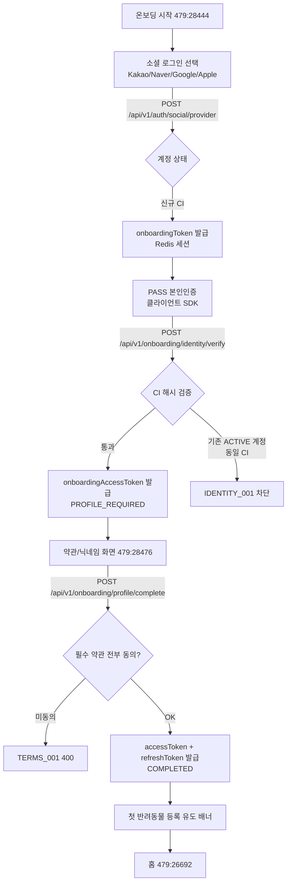

### 정상 경로
1. 소셜 로그인 → `POST /api/v1/auth/social/{provider}` → `onboardingToken` (UUID, Redis, 10분)
2. PASS 본인인증 SDK → `POST /api/v1/onboarding/identity/verify` (`onboardingToken` body 전달) → `onboardingAccessToken` (JWT, 30분)
3. 약관 리스트 조회 `GET /api/v1/terms` → 약관 본문 `GET /api/v1/terms/{id}` (필요 시)
4. 닉네임 + 약관 동의 제출 `POST /api/v1/onboarding/profile/complete` → `accessToken` + `refreshToken`
5. 홈 진입 → 반려동물 0마리면 등록 배너 노출 (서버는 `GET /api/v1/pets` 빈 배열만 반환)

### 분기 · 엣지 케이스
- **동일 CI 활성 계정 존재** — `IDENTITY_001` 차단 (공통 정책 §2.2 Identity Lock)
- **onboardingToken 만료 (10분)** — 소셜 로그인부터 재시작 (`AUTH_001`)
- **필수 약관 누락** — `TERMS_001` (400), 클라이언트 재요청
- **닉네임 중복** — `MEMBER_003` (409) → 재입력
- **본인인증 실패 / 캔슬** — 재시도 가능 (같은 onboardingToken, 10분 내)

### 필요 토큰
`none` → `onboardingToken` → `onboardingAccessToken` → `accessToken` + `refreshToken`

### 연관 기획서
- [03-common-policies.md §1.1](./03-common-policies.md) — 상태별 접근 권한
- [10-announcement-spec.md §3.8](./10-announcement-spec.md) — 약관 동의 통합
- `.claude/CLAUDE.md` — Auth & Onboarding Flow

---

## 2. 기존 회원 로그인 플로우

이미 가입된 회원의 로그인 + 계정 상태 분기 (`ACTIVE+COMPLETED` / `PROFILE_REQUIRED` / `WITHDRAW_REQUESTED`).

### 관련 화면
- 스플래시/로그인: [479:28444](node-id=479:28444), [479:28512](node-id=479:28512)
- 유지보수/강제 업데이트 안내 모달 (스플래시 메타 응답 기반)

### 플로우 다이어그램

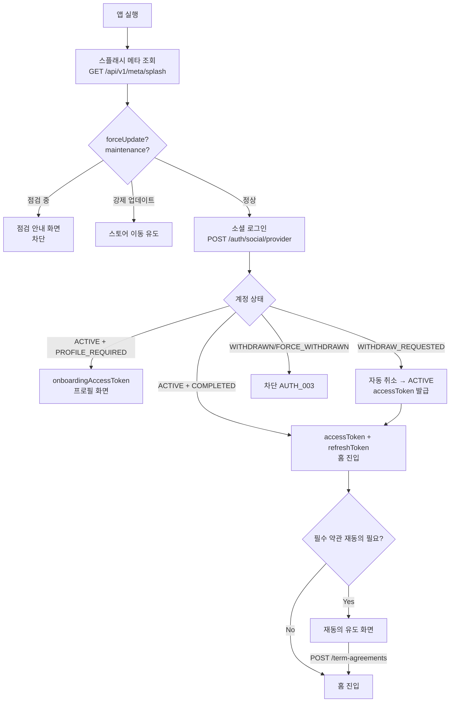

### 정상 경로
1. 앱 실행 → 스플래시 메타 조회 (`AppVersion`, `Maintenance`, 정책 URL)
2. 소셜 로그인 → 상태별 토큰 발급
3. `ACTIVE + COMPLETED` 면 홈 진입. 진입 직전 서버가 `pendingTermAgreements` 확인
4. 재동의 대기 약관 있으면 클라이언트가 우선 처리

### 분기 · 엣지 케이스
- **WITHDRAW_REQUESTED (30일 유예 중)** — 로그인 시 `ACTIVE` 로 자동 복구
- **재동의 대기 약관** — 로그인 응답에 `pendingTermAgreements` 포함, **쓰기 API 호출 시 서버 차단** ([10-announcement-spec.md §3.9, §7](./10-announcement-spec.md))
- **토큰 만료 중 네트워크 호출** — `POST /api/v1/auth/reissue` → 실패 시 재로그인
- **FORCE_WITHDRAWN** — 영구 차단 (`AUTH_003`)

### 필요 토큰
`none` → `accessToken` + `refreshToken`

### 연관 기획서
- `.claude/CLAUDE.md` — 인증 플로우
- [03-common-policies.md §1.1](./03-common-policies.md)
- [10-announcement-spec.md §3.9](./10-announcement-spec.md)

---

## 3. 반려동물 등록 10단계 플로우

소형/대형견, 고양이 분기 + 단계별 뒤로가기/저장/취소 + 완료.

### 관련 화면
- 진입: [479:42184](node-id=479:42184), [479:42359](node-id=479:42359), [479:42534](node-id=479:42534)
- 10단계: [565:28473](node-id=565:28473) → [565:29921](node-id=565:29921) → [565:30231](node-id=565:30231) → [565:30544](node-id=565:30544) → [565:31150](node-id=565:31150) → [565:31460](node-id=565:31460) → [565:32069](node-id=565:32069) → [565:32382](node-id=565:32382) → [565:32695](node-id=565:32695) → [565:33013](node-id=565:33013)
- 완료: [565:33626](node-id=565:33626)
- 고양이 분기: [565:33940](node-id=565:33940)

### 플로우 다이어그램

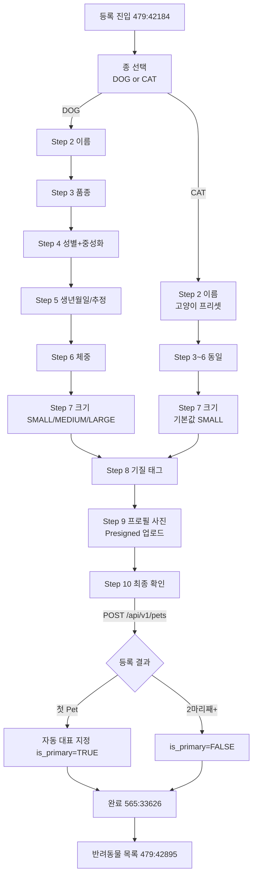

### 정상 경로
1. 10단계 입력을 **클라이언트 로컬 상태**로 수집 (서버 단계별 저장 없음)
2. 마지막 확인 화면에서 `POST /api/v1/pets` 1회 호출
3. 첫 Pet 이면 자동 대표 승격 (`is_primary=TRUE`)

### 분기 · 엣지 케이스
- **고양이 선택** — Step 7(크기) 에서 `SMALL` 프리셋, 나머지 단계는 동일 ([04-pet-spec.md §3.1](./04-pet-spec.md))
- **중간 뒤로가기** — 클라이언트 상태 유지. 앱 종료 시 폐기
- **최대 등록 수 초과 (10마리)** — `PET_004` (409)
- **프로필 사진 업로드 실패** — 이미지 없이도 등록 가능 (`profileImageId` 선택)
- **프로필 사진 COMMIT 실패** — `UPLOAD_002` (400) — 업로드 재시도

### 필요 토큰
`accessToken`

### 연관 기획서
- [04-pet-spec.md §3.1](./04-pet-spec.md)
- [03-common-policies.md §5](./03-common-policies.md) — Presigned 업로드

---

## 4. 업체 검색 플로우

홈/내 주변 진입 → 검색창 → 통합 필터 바텀시트 → 결과 목록/지도 전환 → 저장 필터 적용/저장.

### 관련 화면
- 검색 진입: [479:43541](node-id=479:43541), [479:44981](node-id=479:44981)
- 검색 결과: [479:44710](node-id=479:44710), [479:44853](node-id=479:44853), [480:48180](node-id=480:48180), [479:43567](node-id=479:43567)
- 통합 필터 바텀시트: [565:37178](node-id=565:37178)
- 개별 축 시트 7종: [565:37241](node-id=565:37241) (지역), [565:37304](node-id=565:37304) (거리), [565:37368](node-id=565:37368) (허용 반려동물), [565:37432](node-id=565:37432) (편의시설), [565:37496](node-id=565:37496) (평점), [565:37560](node-id=565:37560) (영업중)
- 저장 플로우: [479:44304](node-id=479:44304), [479:44573](node-id=479:44573), [565:38081](node-id=565:38081), [565:38218](node-id=565:38218)
- 저장 목록: [479:43756](node-id=479:43756), [479:44035](node-id=479:44035), [565:37098](node-id=565:37098), [565:37130](node-id=565:37130), [610:48257](node-id=610:48257)
- 적용: [479:43895](node-id=479:43895)
- 삭제: [603:41728](node-id=603:41728), [479:44441](node-id=479:44441)

### 플로우 다이어그램 (메인)

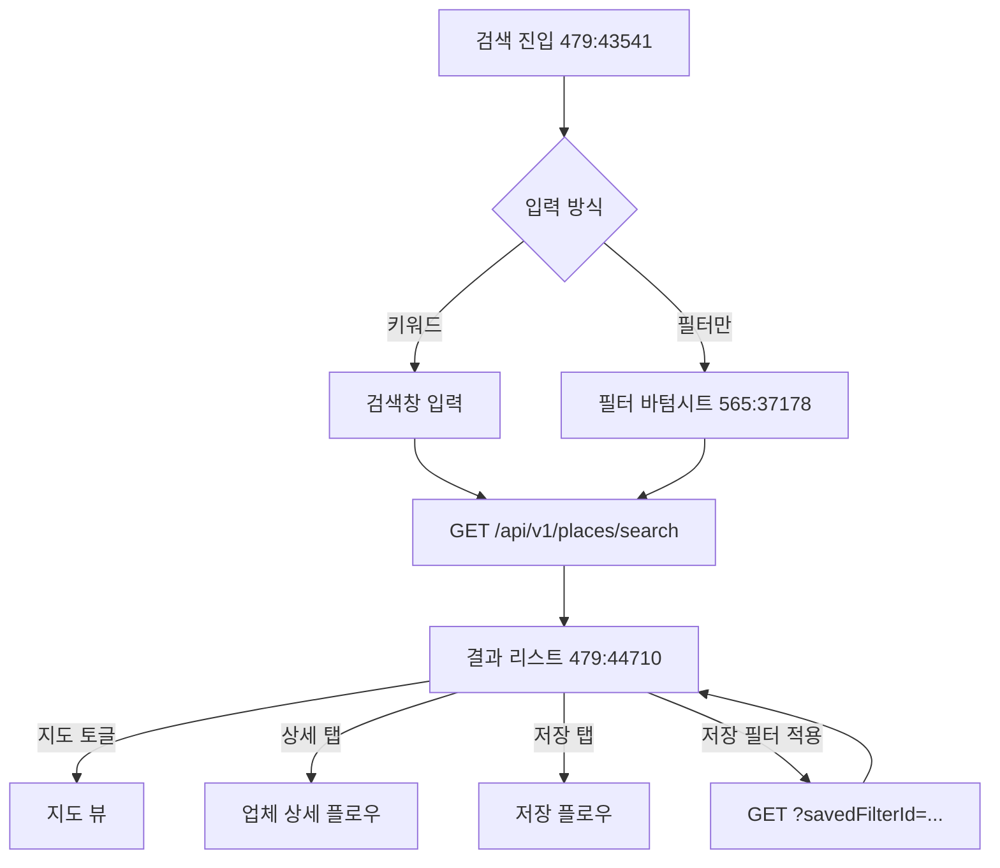

### 플로우 다이어그램 (저장 필터 서브)

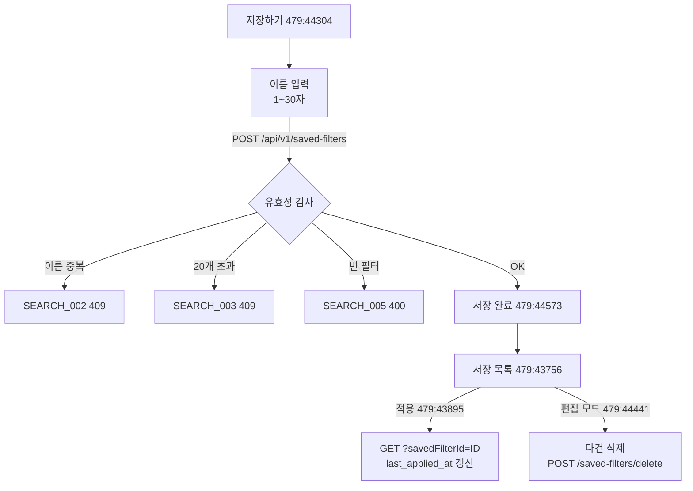

### 정상 경로
1. 검색 진입 → 키워드/필터 조합 설정 → `GET /api/v1/places/search?...` (비로그인 허용)
2. 결과 리스트 ↔ 지도 전환 (서버 재호출 없이 같은 응답 데이터 재사용)
3. 저장 필요 시 → `POST /api/v1/saved-filters` → 이름 입력 후 제출
4. 저장 목록 진입 → `GET /api/v1/saved-filters?sort=...`
5. 적용 시 → `GET /api/v1/places/search?savedFilterId=42&lat=...&lng=...` (overlay 우선)

### 분기 · 엣지 케이스
- **좌표 없음 + `sort=distance`** — `PLACE_005` (400) → 위치 권한 재요청
- **편의시설 필터 OR 연산** — 회원 확정 사항 (사용자 결정 - [Phase 4 요구사항](#))
- **저장 필터 적용 시 overlay 우선** — 좌표/키워드는 쿼리 파라미터가 `filter_json` 보다 우선
- **저장 필터 최대 20개** — `SEARCH_003` 에서 "오래된 필터 삭제" UX 유도
- **동명 저장 필터** — `SEARCH_002` (회원당 이름 UNIQUE)
- **소프트 삭제 후 동일 이름 재생성** — 허용 (부분 UNIQUE 인덱스)

### 필요 토큰
목록/검색: `none` (비로그인 허용) · 저장 필터 관련: `accessToken`

### 연관 기획서
- [05-place-spec.md §3.1, §3.3](./05-place-spec.md)
- [08-search-filter-spec.md §3, §4](./08-search-filter-spec.md)

---

## 5. 업체 상세 조회 플로우

목록/지도 → 상세 → 리뷰 목록/맞춤리뷰 → 연락(전화/카톡/이메일/예약/신고) 팝업.

### 관련 화면
- 상세: [480:50352](node-id=480:50352), [479:24162](node-id=479:24162), [479:24418](node-id=479:24418)
- 리뷰 섹션: [479:23645](node-id=479:23645), [479:23816](node-id=479:23816), [479:26205](node-id=479:26205)
- 맞춤리뷰 토글: [565:42655](node-id=565:42655)
- 연락 팝업: [479:24707](node-id=479:24707) (카톡), [603:42166](node-id=603:42166) (전화), [479:25381](node-id=479:25381) (이메일), [489:54774](node-id=489:54774) (예약)
- 신고: [489:56526](node-id=489:56526)

### 플로우 다이어그램

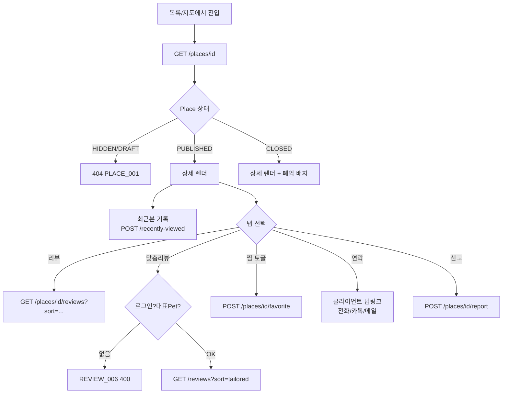

### 정상 경로
1. `GET /api/v1/places/{id}` → 상세 데이터 + `isFavorited`(로그인 시)
2. 로그인 상태면 비동기 `POST /api/v1/members/me/recently-viewed { placeId }`
3. 리뷰 섹션 로드 `GET /api/v1/places/{id}/reviews?sort=latest`
4. 맞춤리뷰 탭 → `?sort=tailored` (대표 Pet 필수)
5. 찜 토글 → `POST`/`DELETE /api/v1/places/{id}/favorite`
6. 연락 버튼 → 서버 호출 없음, 클라이언트가 `tel:`/`mailto:`/`kakaoplus://` 딥링크

### 분기 · 엣지 케이스
- **비로그인** — 상세 조회 OK, 찜/맞춤리뷰/최근본/리뷰 작성 버튼은 로그인 유도
- **CLOSED 업체** — 상세 접근 가능 + 폐업 뱃지. 찜/리뷰 작성 `PLACE_004` (409)
- **HIDDEN/DRAFT** — `PLACE_001` (404)
- **비로그인 + 전화번호 노출** — 마스킹 적용 (사용자 확정 사항)
- **맞춤리뷰 대표 Pet 없음** — `REVIEW_006` → "대표 반려동물을 먼저 설정해주세요" 안내

### 필요 토큰
조회: `none` · 찜/리뷰/최근본/신고: `accessToken`

### 연관 기획서
- [05-place-spec.md §3.2, §3.6](./05-place-spec.md)
- [06-review-spec.md §3.4, §3.8](./06-review-spec.md)
- [07-wishlist-spec.md §3.1, §3.5](./07-wishlist-spec.md)

---

## 6. 리뷰 작성 플로우

업체 상세 → 4단계 입력 (별점/반려동물/사진/본문) → 완료 or 취소 → 1 리뷰 제약 충돌 시 수정 플로우로 우회.

### 관련 화면
- 작성 A~D: [479:42852](node-id=479:42852), [603:45278](node-id=603:45278), [603:45369](node-id=603:45369), [603:45483](node-id=603:45483)
- 완료: [479:42712](node-id=479:42712)
- 취소/삭제 모달: [479:42776](node-id=479:42776)

### 플로우 다이어그램

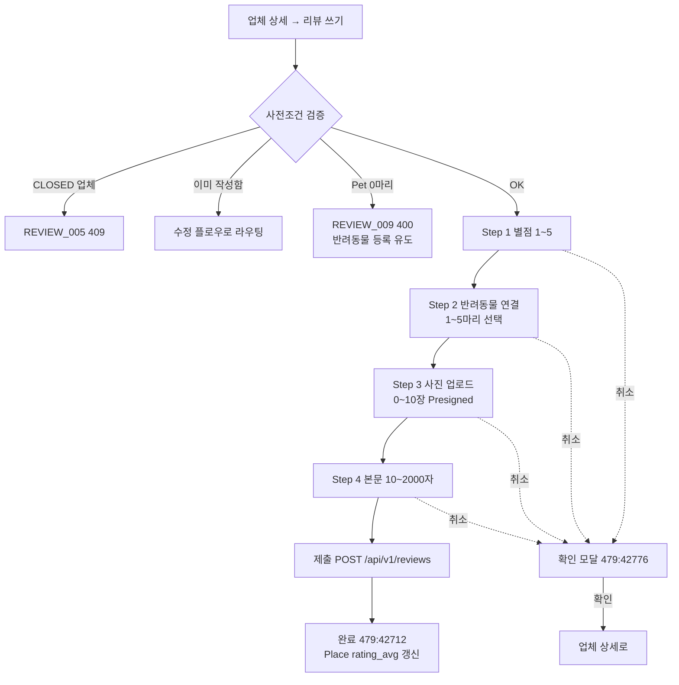

### 정상 경로
1. 작성 버튼 → 클라이언트가 사전조건 확인 (`GET /api/v1/pets` 로 활성 Pet 수 확인)
2. 4단계 입력을 클라이언트 로컬 상태로 수집
3. 사진은 Step 3 에서 Presigned 업로드 완료 → imageId 수집
4. 최종 제출 `POST /api/v1/reviews` → `ReviewResponse`
5. 서버가 트랜잭션 내 `review_pets` 스냅샷 생성, `places.rating_avg`/`review_count` 갱신

### 분기 · 엣지 케이스
- **이미 작성한 리뷰** — `REVIEW_002` (409) → 클라이언트가 `GET /api/v1/members/me/reviews` 로 기존 리뷰 조회 후 수정 화면으로 라우팅
- **CLOSED 업체** — `REVIEW_005` (409) → "폐업한 업체에는 리뷰 작성 불가" 토스트
- **Pet 0마리** — `REVIEW_009` (400) → 반려동물 등록 유도
- **이미지 COMMIT 안 됨** — `UPLOAD_002` (400)
- **타인/삭제된 Pet 선택** — `REVIEW_007` (400)
- **본문 길이 위반** — `REVIEW_003` (400)
- **작성 중 앱 종료** — 클라이언트 상태 폐기, 이미지는 24h 후 배치 정리

### 필요 토큰
`accessToken`

### 연관 기획서
- [06-review-spec.md §3.1, §4](./06-review-spec.md)
- [04-pet-spec.md §3.2](./04-pet-spec.md)

---

## 7. 리뷰 수정 / 삭제 플로우

나의 리뷰 목록 → 수정 or 삭제 확인 → 처리.

### 관련 화면
- 나의 리뷰: [479:43215](node-id=479:43215), [479:43311](node-id=479:43311)
- 수정 진입: [479:43424](node-id=479:43424), [479:43075](node-id=479:43075), [479:43139](node-id=479:43139)
- 삭제 확인: [479:43521](node-id=479:43521)

### 플로우 다이어그램

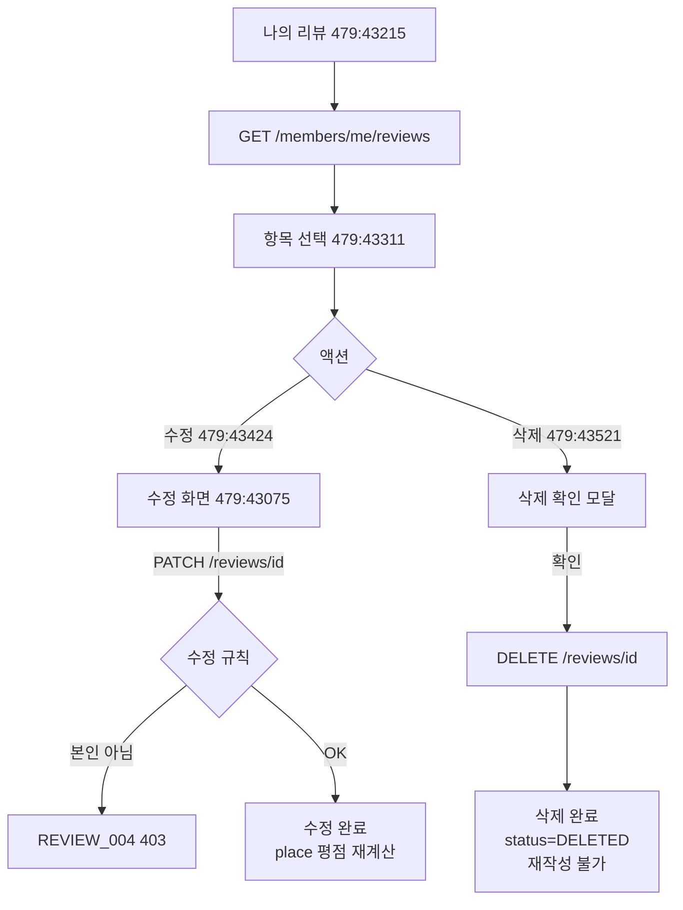

### 정상 경로 및 분기
1. 내 리뷰 목록 (`ACTIVE + HIDDEN` 노출, `DELETED` 제외)
2. 수정: `PATCH /api/v1/reviews/{id}` — `rating`/`content`/`visitDate`/`petIds`/`imageIds` 부분 업데이트
3. 삭제: `DELETE /api/v1/reviews/{id}` — 소프트 삭제. 재작성 불가 원칙 ([06-review-spec.md §4.1 불변식 1](./06-review-spec.md))
4. **Pet 스냅샷 규칙**: 유지되는 Pet 은 기존 스냅샷 유지, 추가 Pet 은 현재 속성으로 신규 스냅샷, 제거 Pet 은 row 삭제
5. **신고 누적으로 HIDDEN 된 리뷰** — 작성자 본인은 수정 가능 (상태 유지)

### 필요 토큰
`accessToken`

### 연관 기획서
- [06-review-spec.md §3.2, §3.3, §3.6](./06-review-spec.md)

---

## 8. 찜 / 최근 본 장소 플로우

업체 토글 찜 → 찜 리스트 조회/제거, 상세 조회 시 자동 최근본 기록.

### 관련 화면
- 찜 목록: [479:26968](node-id=479:26968), [479:26994](node-id=479:26994) (Empty)
- 최근 본 장소: [479:26749](node-id=479:26749), [479:26764](node-id=479:26764) (선택 삭제), [559:12184](node-id=559:12184) (Empty)

### 플로우 다이어그램

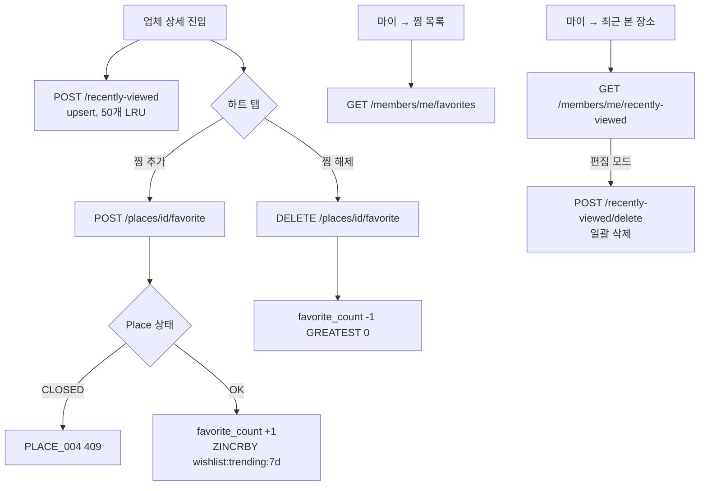

### 정상 경로
1. 업체 상세 진입 (로그인 시) → 비동기 `POST /api/v1/members/me/recently-viewed { placeId }` (서버가 upsert + 50개 LRU)
2. 하트 토글 — idempotent POST/DELETE
3. 찜/최근본 목록 → cursor 페이지네이션
4. 최근본 편집 모드: 다건 일괄 삭제 or 전체 삭제

### 분기 · 엣지 케이스
- **CLOSED 업체 신규 찜** — `PLACE_004` (409)
- **찜 목록에서 업체가 HIDDEN 으로 전환** — 다음 페이지부터 제외 (graceful)
- **찜 목록에서 업체가 CLOSED** — 목록 유지 + "폐업" 뱃지
- **Redis ZSet 다운** — 트렌딩 API 는 빈 배열 fallback (사용자 확정)
- **동시에 두 번 찜 추가** — UNIQUE + `ON CONFLICT DO NOTHING`

### 필요 토큰
`accessToken`

### 연관 기획서
- [07-wishlist-spec.md §3](./07-wishlist-spec.md)

---

## 9. 알림 플로우

알림 수신 (푸시) → 앱 진입 → 알림 탭 → 딥링크 이동 (리뷰/공지/문의).

### 관련 화면
- 알림 목록: [479:26663](node-id=479:26663)
- 알림 설정: [479:26451](node-id=479:26451), [479:47142](node-id=479:47142)

### 플로우 다이어그램

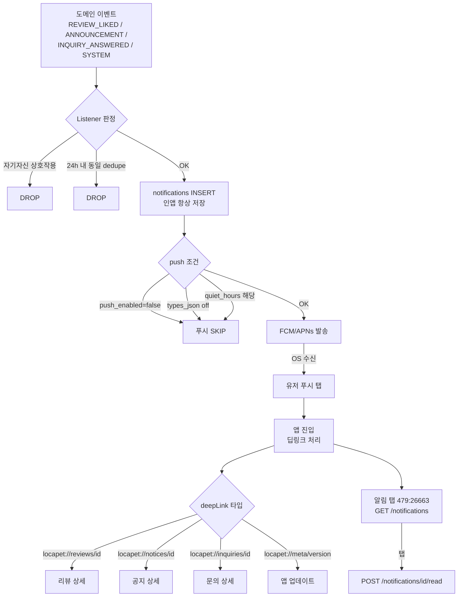

### 정상 경로
1. 도메인 이벤트 발행 (`REVIEW_LIKED` / `ANNOUNCEMENT` / `INQUIRY_ANSWERED` / `SYSTEM`)
2. Notification Listener: 설정 · 방해금지 · dedupe 검사 → 인앱 저장 + 푸시 발송
3. 푸시 수신 → 탭 → 딥링크 처리
4. 알림 목록 조회 `GET /api/v1/notifications` — **탭한 순간에만 읽음 처리** (사용자 확정)
5. 뱃지 숫자 `GET /api/v1/notifications/unread-count` (30초 Redis 캐시)
6. 알림 설정 화면 `GET/PATCH /api/v1/notifications/settings`
7. 로그인/앱 시작 시 `POST /api/v1/notifications/devices` (토큰 UPSERT)

### 분기 · 엣지 케이스
- **quiet_hours (방해금지) 해당 시** — 푸시 drop (재발송 없음, 사용자 확정)
- **`InvalidRegistration` 응답** — `device_tokens.is_active=FALSE`
- **동일 이벤트 24h 내 재발행** — dedupe key 로 drop
- **90일 초과 알림** — 배치 hard delete
- **탈퇴 완료** — `notifications`/`device_tokens`/`notification_settings` hard delete
- **인앱 알림은 설정 무관 저장** — 알림센터 이력 보존

### 필요 토큰
`accessToken`

### 연관 기획서
- [09-notification-spec.md §3](./09-notification-spec.md)

---

## 10. 1:1 문의 플로우

작성(카테고리→본문→첨부) → 목록 → 수정/삭제 (PENDING 만) → 답변 수신 (알림) → CLOSED.

### 관련 화면
- 작성: [479:27291](node-id=479:27291), [479:27312](node-id=479:27312) (유형 선택), [522:28949](node-id=522:28949), [479:27377](node-id=479:27377) (카테고리 수정)
- 완료: [479:27334](node-id=479:27334)
- 목록: [522:28838](node-id=522:28838), [565:41948](node-id=565:41948), [565:42034](node-id=565:42034), [565:42120](node-id=565:42120)
- 수정: [522:28723](node-id=522:28723), [479:27179](node-id=479:27179)

### 플로우 다이어그램

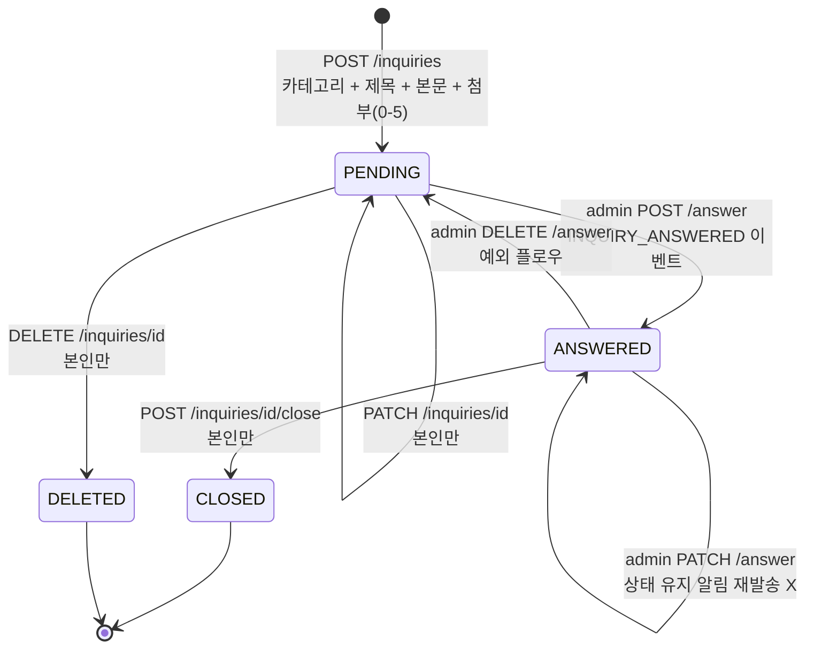

### 플로우 다이어그램 (유저 경로)

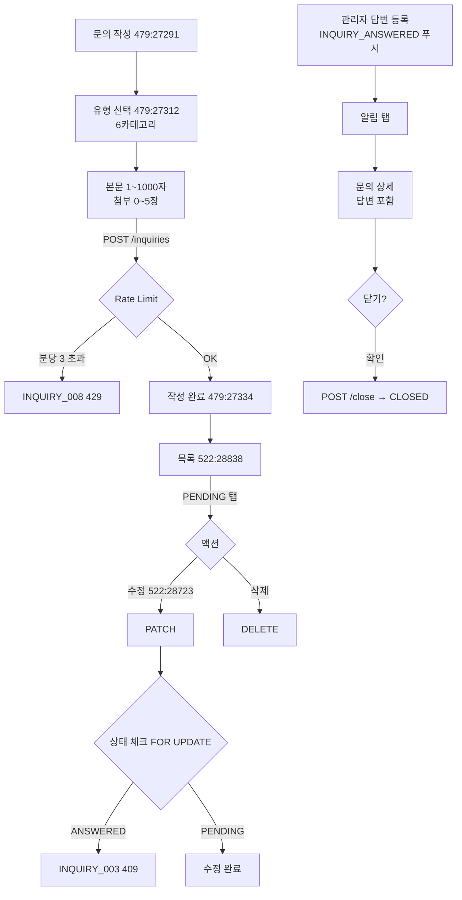

### 정상 경로
1. 문의 작성 → `POST /api/v1/inquiries` (카테고리 6종, 본문 1000자, 첨부 5장)
2. Rate limit: 분당 3건, 일 30건 (사용자 확정)
3. 목록 조회 `GET /api/v1/inquiries?status=ALL|PENDING|ANSWERED|CLOSED`
4. **PENDING 에서만** 수정/삭제 (사용자 확정)
5. 관리자 답변 → `INQUIRY_ANSWERED` 이벤트 → 푸시 + 인앱 알림
6. 유저가 답변 확인 후 `POST /api/v1/inquiries/{id}/close` → `CLOSED`

### 분기 · 엣지 케이스
- **ANSWERED/CLOSED 에서 수정/삭제** — `INQUIRY_003` (409)
- **PENDING 에서 닫기** — `INQUIRY_005` (409)
- **첨부 5장 초과** — `INQUIRY_007` (400)
- **Rate limit 초과** — `INQUIRY_008` (429)
- **답변 수정 시 알림 재발송** — 안 함 (스팸 방지)
- **탈퇴 완료** — 문의 row 유지 + 작성자 익명화 ([03-common-policies.md §2.1](./03-common-policies.md))
- **동시성** — PATCH/답변 등록 간 `SELECT ... FOR UPDATE`

### 필요 토큰
`accessToken`

### 연관 기획서
- [11-inquiry-spec.md §3, §4, §7](./11-inquiry-spec.md)

---

## 11. 탈퇴 / 재가입 플로우

탈퇴 요청 → 30일 유예 → `WITHDRAW_REQUESTED` 기간 내 재로그인 시 자동 취소 → `WITHDRAWN` 확정.

### 관련 화면
- 마이페이지 → 설정 → 탈퇴 (Figma node id 구체 미확정 — 기존 auth 구현 기반)

### 플로우 다이어그램

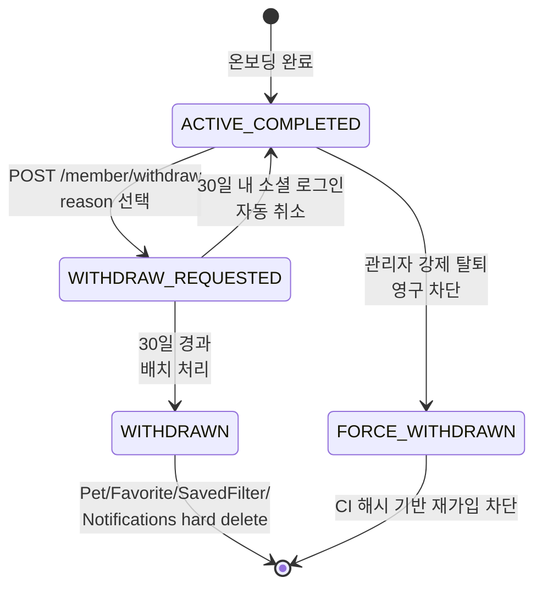

### 플로우 다이어그램 (상세 경로)

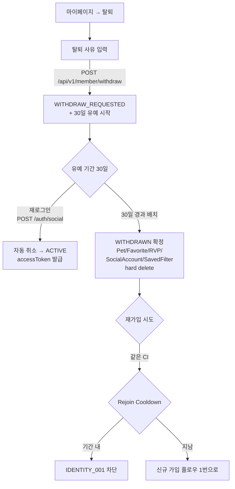

### 정상 경로
1. 탈퇴 요청 → `POST /api/v1/member/withdraw` (기존 구현) → `AccountStatus=WITHDRAW_REQUESTED`
2. 30일 유예 중 재로그인 → `AccountStatus` 자동 `ACTIVE` 복구 (기존 구현)
3. 30일 경과 시 배치 → `WITHDRAWN` + 데이터 정리
4. 재가입 시도 (같은 CI) — Identity Lock Cooldown 정책 적용

### 분기 · 엣지 케이스
- **유예 중 데이터 조회** — 허용 (ACTIVE 와 동일)
- **유예 중 리뷰/찜 신규 작성** — 허용
- **WITHDRAWN 후 데이터 정리**:
  - Hard delete: `Pet`, `Favorite`, `RecentlyViewed`, `SocialAccount`, `SavedFilter`, `Notifications`, `DeviceTokens`, `NotificationSettings`
  - 유지: `Member` row (상태만 변경) + CI 해시, `Review` (익명화), `Inquiry` (익명화), `member_term_agreements` (감사 로그)
- **FORCE_WITHDRAWN** — 영구 차단. `PermanentlyBannedException`
- **WITHDRAW_REQUESTED 중 관리자 강제 탈퇴** — 우선 적용, 자동 취소 불가

### 필요 토큰
`accessToken` (탈퇴 요청 시)

### 연관 기획서
- [03-common-policies.md §2.1](./03-common-policies.md)
- `.claude/CLAUDE.md` — Member State Model

---

## 12. 플로우 간 전환 매트릭스 (요약)

| 출발 플로우 | 대상 플로우 | 트리거 |
|---|---|---|
| 1. 신규 가입 | 3. Pet 등록 | 온보딩 완료 후 배너 탭 |
| 2. 로그인 | 4. 검색 / 5. 상세 | 홈 진입 후 |
| 4. 검색 | 5. 상세 | 결과 카드 탭 |
| 5. 상세 | 6. 리뷰 작성 | "리뷰 쓰기" 버튼 |
| 5. 상세 | 8. 찜 토글 | 하트 아이콘 |
| 6. 리뷰 작성 | 7. 수정 (충돌 시) | `REVIEW_002` 후 라우팅 |
| 9. 알림 | 5/7/10. 각 상세 | 딥링크 |
| 11. 탈퇴 | 1. 신규 가입 | WITHDRAWN 후 Cooldown 지난 뒤 |

---

## 13. 미결 사항 (Phase 5 API 설계 전 최종 확정 필요)

1. **고양이 등록 플로우의 스킵 단계** — Step 7(크기) 프리셋 SMALL 유지 vs 스킵. 현재는 "프리셋" 제안 ([04-pet-spec.md §9.3](./04-pet-spec.md))
2. **재동의 대기 약관 있을 때 쓰기 API 차단 범위** — "모든 쓰기 API 차단" 으로 사용자 확정 but 세부 에러 코드 정의 필요 ([10-announcement-spec.md §7](./10-announcement-spec.md))
3. **리뷰 작성 시 Pet 0마리 허용 여부** — 현재 "필수" 제안(`REVIEW_009`). 최종 확정 필요
4. **맞춤리뷰 "유사 크기" 매칭 범위** — SMALL↔MEDIUM, MEDIUM↔LARGE 느슨 매칭을 Phase 4 에서 MVP 포함할지 vs Phase 5+ 로 미룰지
5. **저장 필터 정렬의 overlay 우선순위** — 사용자 확정 "저장 필터 sort 적용 시 overlay 우선" — 키워드/좌표/`sort` 파라미터 모두 overlay 우선인지 재확인
6. **푸시 딥링크 `locapet://meta/version`** — 앱 내 업데이트 안내 화면 구성 확인 필요
7. **탈퇴 Figma 화면 ID 식별** — 마이페이지 → 설정 → 탈퇴 노드 확인 필요 (현재 기획서 기반 플로우만 정의)
8. **편의시설 필터 연산자** — 사용자 확정 "OR 연산" 으로 변경 — [08-search-filter-spec.md §4.3](./08-search-filter-spec.md) 의 AND 제안과 상충, Phase 5 에서 최종 반영 필요

---

## 14. 관련 문서

- [00. 서비스 개요](./00-overview.md)
- [01. 도메인 맵](./01-domain-map.md)
- [03. 공통 정책](./03-common-policies.md)
- [13. 화면-API 매핑표](./13-screen-api-map.md)
- 도메인별 상세: [04. Pet](./04-pet-spec.md) · [05. Place](./05-place-spec.md) · [06. Review](./06-review-spec.md) · [07. Wishlist](./07-wishlist-spec.md) · [08. Search](./08-search-filter-spec.md) · [09. Notification](./09-notification-spec.md) · [10. Announcement](./10-announcement-spec.md) · [11. Inquiry](./11-inquiry-spec.md)
